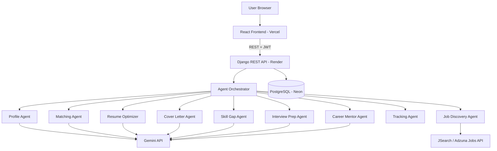

# 🚀 CareerPilot — AI-Powered Intelligent Job Application Assistant
### Complete 24-Hour Hackathon Master Plan (Team of 4)

> **How to read this document:** Everything is explained in simple language. If a section feels big, just read the bold lines and tables first. This is your single source of truth for the next 24 hours.

---

# 1. Product Requirements Document (PRD)

## 1.1 One-Line Solution
**CareerPilot is a personal AI career assistant that finds jobs for you, checks how well you fit, rewrites your resume for each job, writes your cover letter, and tracks everything — all from one profile you create once.**

## 1.2 Elevator Pitch (say this to judges)
"Applying to jobs today is a full-time job itself. You search 10 websites, rewrite your resume 10 times, and write 10 cover letters. CareerPilot does all of that for you. You upload your resume once, tell it what you want, and a team of 9 AI agents finds jobs, scores your fit, tailors your resume, writes cover letters, and preps you for interviews — automatically."

## 1.3 The Problem (in simple words)
Imagine a student named Priya. She wants a software job. Every day she:
1. Opens LinkedIn, Naukri, and company websites (1 hour)
2. Reads long job descriptions to check if she fits (1 hour)
3. Edits her resume to match keywords (1 hour)
4. Writes a cover letter from scratch (30 mins)
5. Fills the same form details again and again (30 mins)

That's **4 hours for maybe 3 applications**. And she still gets rejected because her resume doesn't match what the company's ATS robot is looking for.

## 1.4 The Solution
One profile → AI does the boring work → Priya only reviews and clicks "Apply".

## 1.5 Target Users (Personas)

| Persona | Who they are | Their pain | What they want |
|---|---|---|---|
| **Priya (Student)** | Final year B.Tech | Doesn't know what ATS wants | Quick, guided applications |
| **Rahul (Fresher)** | 0 experience, 100 rejections | Generic resume gets ignored | Resume tailored per job |
| **Anita (Experienced)** | 5 yrs, wants a switch | No time to job hunt | Automation + tracking |
| **Vikram (Career Switcher)** | Testing → Data Science | Doesn't know skill gaps | Gap analysis + roadmap |

## 1.6 Success Metrics (what "winning" looks like)
- User can go from **signup → tailored resume + cover letter in under 3 minutes**
- Job match score with a **clear explanation** (not just a number)
- Full pipeline demo works live, end to end, without crashing

---

# 2. Detailed Feature Breakdown (MoSCoW)

Think of MoSCoW like packing a bag: **Must** = things you can't travel without. **Should** = very useful. **Could** = nice extras. **Won't** = leave at home this trip.

| Priority | Feature | Simple Description | Effort |
|---|---|---|---|
| **MUST** | User Auth (JWT) | Sign up / log in securely | S |
| **MUST** | Resume Upload + Parsing | Upload PDF → AI extracts skills, education, projects | M |
| **MUST** | Master Profile | One profile with all your details | S |
| **MUST** | Job Discovery | Fetch real jobs from a jobs API | M |
| **MUST** | Job Matching + Fit Score | "You match 82% — here's why" | M |
| **MUST** | ATS Score | How robot-friendly is your resume (0–100) | S |
| **MUST** | Resume Optimization | AI rewrites resume for a specific job | M |
| **MUST** | Cover Letter Generator | Personalized letter in your tone | S |
| **MUST** | Application Dashboard | Kanban board: Saved → Applied → Interview → Offer | M |
| **SHOULD** | Skill Gap Analysis | "You're missing Docker — learn it here" | S |
| **SHOULD** | Interview Prep | Likely questions for THIS job | S |
| **SHOULD** | Career Roadmap | "Next 2 years: learn X, target role Y" | S |
| **COULD** | Agent Workflow Visualizer | Live animation of agents working (judge magnet 🧲) | M |
| **COULD** | Salary Insights | Expected salary range for matched jobs | S |
| **WON'T** | Real auto-submission to company ATS | Simulated only (we tell judges honestly) | — |
| **WON'T** | Recruiter Dashboard | Post-hackathon | — |

**Hackathon rule:** Build every MUST first. Touch SHOULD only after all MUSTs work end to end.

---

# 3. User Stories

Format: *As a [person], I want [thing], so that [benefit].*

1. As a **student**, I want to upload my resume once, so that I never re-type my details again.
2. As a **user**, I want AI to find jobs matching my preferences, so that I stop searching 10 websites.
3. As a **user**, I want a fit score with reasons, so that I know which jobs are worth my time.
4. As a **fresher**, I want my resume rewritten for each job, so that I pass ATS filters.
5. As a **user**, I want a cover letter generated in seconds, so that I don't stare at a blank page.
6. As a **user**, I want to see all my applications on one dashboard, so that I never lose track.
7. As a **career switcher**, I want to know my missing skills, so that I can close the gap.
8. As a **user**, I want likely interview questions for a specific job, so that I walk in prepared.
9. As a **user**, I want a career roadmap, so that I know what to do after this job.
10. As a **user**, I want to download my tailored resume as PDF, so that I can apply anywhere.

---

# 4. Functional Requirements (what the system SHALL do)

- FR-01: The system **shall** allow registration and login using email + password (JWT tokens).
- FR-02: The system **shall** accept PDF resume uploads (max 5 MB).
- FR-03: The system **shall** extract skills, education, experience, and projects from the resume using AI.
- FR-04: The system **shall** let users set job preferences (role, location, experience level, work mode).
- FR-05: The system **shall** fetch real job listings from an external jobs API and store them.
- FR-06: The system **shall** compute a 0–100 fit score between the profile and each job, with a written explanation.
- FR-07: The system **shall** compute an ATS compatibility score for the resume.
- FR-08: The system **shall** generate a job-specific optimized resume (truthful — no invented facts).
- FR-09: The system **shall** generate a personalized cover letter per job.
- FR-10: The system **shall** track each application through stages (Saved, Applied, Interview, Offer, Rejected).
- FR-11: The system **shall** list missing skills per job and recommend learning resources.
- FR-12: The system **shall** generate interview questions (technical + HR) per job.
- FR-13: The system **shall** allow downloading generated resumes/cover letters as PDF.

---

# 5. Non-Functional Requirements (how WELL it should work)

| Category | Requirement |
|---|---|
| **Performance** | AI generation shows a progress indicator; results within ~15s; normal pages < 2s |
| **Security** | Passwords hashed; API keys in environment variables (NEVER in code); JWT expiry |
| **Reliability** | If Gemini API fails → show friendly retry message, never a crash |
| **Usability** | Works on laptop + mobile; judge can use it without instructions |
| **Availability** | Deployed publicly before demo; a local backup running too |
| **Honesty** | AI must never invent fake experience in resumes (truthfulness guardrail in prompts) |

---

# 6. System Architecture (the big picture)

**Simple explanation:** Think of our app like a restaurant 🍽️
- **Frontend (React)** = the dining area where customers sit
- **Backend (Django)** = the kitchen where all work happens
- **Database (PostgreSQL)** = the storeroom where ingredients are kept
- **AI Agents (Gemini)** = 9 specialist chefs, each great at one dish
- **Orchestrator** = the head chef who tells each specialist when to cook

**KEY DECISION (very important for 24 hours):**
We do **NOT** build 9 separate services. All 9 "agents" are just **Python classes inside one Django app**, each with its own specialized Gemini prompt. One backend, one deployment, zero microservice headaches. To judges, it still IS a multi-agent system — because each agent has a distinct role, prompt, input, and output, coordinated by an orchestrator.

## 6.1 Components

| Component | Responsibility | Owner |
|---|---|---|
| React SPA | All screens, calls backend APIs | Member 1 |
| Django REST API | Auth, CRUD, orchestrating agents | Member 2 |
| Agent Layer (Python module) | 9 agent classes + orchestrator | Member 3 |
| PostgreSQL (Neon) | All persistent data | Member 2 |
| Jobs API (JSearch/Adzuna) | Source of real job listings | Member 3 |
| Gemini API | The brain of every agent | Member 3 |
| Vercel + Render | Hosting | Member 4 |

---

# 7. High-Level Architecture Diagram

```
                        ┌──────────────────────────────┐
                        │        USER (Browser)         │
                        └──────────────┬───────────────┘
                                       │ HTTPS
                        ┌──────────────▼───────────────┐
                        │   REACT FRONTEND (Vercel)     │
                        │  Vite + Tailwind + ShadCN     │
                        └──────────────┬───────────────┘
                                       │ REST + JWT
                        ┌──────────────▼───────────────┐
                        │  DJANGO REST API (Render)     │
                        │ ┌───────────────────────────┐ │
                        │ │     AGENT ORCHESTRATOR    │ │
                        │ │  (head chef — routes work)│ │
                        │ └─────┬───────┬─────────┬───┘ │
                        │   ┌───▼──┐ ┌──▼───┐ ┌───▼──┐  │
                        │   │Agent │ │Agent │ │Agent │  │
                        │   │ 1–3  │ │ 4–6  │ │ 7–9  │  │
                        │   └───┬──┘ └──┬───┘ └───┬──┘  │
                        └───────┼───────┼─────────┼─────┘
                          ┌─────▼─┐ ┌───▼────┐ ┌──▼──────────┐
                          │Gemini │ │ Jobs   │ │ PostgreSQL  │
                          │  API  │ │ API    │ │   (Neon)    │
                          └───────┘ └────────┘ └─────────────┘
```

Mermaid version (paste into mermaid.live for the SRS):



---

# 8. Database Schema

**Simple explanation:** A database is like a set of Excel sheets that talk to each other. Each table below is one sheet.

```
users ──1:1── profiles ──1:N── resumes
users ──1:N── applications ──N:1── jobs
applications ──1:N── generated_documents
applications ──1:1── match_results
jobs (shared pool, fetched from Jobs API)
```

### Tables (main columns only)

**users**
| Column | Type | Notes |
|---|---|---|
| id | UUID (PK) | |
| email | varchar, unique | login id |
| password | hashed | Django handles hashing |
| created_at | timestamp | |

**profiles** (1 per user)
| Column | Type | Notes |
|---|---|---|
| id | UUID (PK) | |
| user_id | FK → users | |
| full_name, phone, location | varchar | |
| skills | JSONB | ["python", "react", ...] |
| education | JSONB | list of degrees |
| experience | JSONB | list of jobs/internships |
| projects | JSONB | list of projects |
| preferences | JSONB | {role, locations, mode, exp_level} |

**resumes**
| Column | Type | Notes |
|---|---|---|
| id | UUID (PK) | |
| profile_id | FK | |
| file_url / file | file field | original PDF |
| parsed_text | text | raw extracted text |
| ats_score | int | 0–100 |
| is_master | boolean | the original one |

**jobs**
| Column | Type | Notes |
|---|---|---|
| id | UUID (PK) | |
| external_id | varchar | id from jobs API (avoid duplicates) |
| title, company, location | varchar | |
| description | text | full JD |
| skills_required | JSONB | extracted by AI |
| salary_range, work_mode, url | varchar | |
| posted_at | timestamp | |

**match_results**
| Column | Type | Notes |
|---|---|---|
| id | UUID (PK) | |
| profile_id, job_id | FKs | |
| fit_score | int | 0–100 |
| reasoning | text | why this score |
| matched_skills | JSONB | |
| missing_skills | JSONB | feeds Skill Gap agent |

**applications**
| Column | Type | Notes |
|---|---|---|
| id | UUID (PK) | |
| user_id, job_id | FKs | |
| status | enum | saved / applied / interview / offer / rejected |
| applied_at, updated_at | timestamp | |
| notes | text | |

**generated_documents**
| Column | Type | Notes |
|---|---|---|
| id | UUID (PK) | |
| application_id | FK | |
| doc_type | enum | tailored_resume / cover_letter / interview_prep / roadmap |
| content | JSONB/text | AI output |
| created_at | timestamp | |

**Why JSONB a lot?** Because AI outputs are flexible-shaped, and in 24 hours we don't want migration headaches. PostgreSQL JSONB = best of both worlds.

---

# 9. API Design

Base URL: `/api/v1/` — All protected routes need header `Authorization: Bearer <token>`

| Method | Endpoint | Purpose | Auth |
|---|---|---|---|
| POST | `/auth/register` | Create account | ❌ |
| POST | `/auth/login` | Get JWT tokens | ❌ |
| GET/PUT | `/profile` | View / edit master profile | ✅ |
| POST | `/resumes/upload` | Upload PDF → triggers Profile Agent (parse + ATS score) | ✅ |
| GET | `/resumes/{id}` | Parsed data + ATS score | ✅ |
| POST | `/jobs/discover` | Trigger Job Discovery Agent (uses preferences) | ✅ |
| GET | `/jobs` | List jobs (filters: location, mode, q, page) | ✅ |
| POST | `/jobs/{id}/match` | Trigger Matching Agent → fit score + reasoning | ✅ |
| POST | `/jobs/{id}/optimize-resume` | Tailored resume for this job | ✅ |
| POST | `/jobs/{id}/cover-letter` | Cover letter for this job | ✅ |
| POST | `/jobs/{id}/interview-prep` | Question bank for this job | ✅ |
| GET | `/jobs/{id}/skill-gap` | Missing skills + learning links | ✅ |
| POST | `/applications` | Save/apply to a job | ✅ |
| GET | `/applications` | Dashboard data (grouped by status) | ✅ |
| PATCH | `/applications/{id}` | Move card (change status) | ✅ |
| GET | `/career/roadmap` | Career Mentor Agent output | ✅ |
| GET | `/documents/{id}/download` | Download PDF | ✅ |

**Error format (consistent everywhere):**
```json
{ "error": { "code": "AI_TIMEOUT", "message": "Our AI is busy, please retry." } }
```

**Long-running AI calls:** For the hackathon, keep calls synchronous (15–30s) with a nice loading animation showing "agents at work". No Celery/queues — that's a time trap. If a call is slow, the animated agent visualizer makes waiting feel like a feature. 😉

---

# 10. Frontend Pages

| # | Page | What's on it | Priority |
|---|---|---|---|
| 1 | Landing | Hero, "How it works" in 3 steps, CTA | Must |
| 2 | Register / Login | Simple forms | Must |
| 3 | Onboarding Wizard | Step 1: upload resume → Step 2: AI-filled profile (editable) → Step 3: preferences | Must |
| 4 | Job Feed | Cards with fit-score badges, filters, "Analyze Match" button | Must |
| 5 | Job Detail | JD + fit score circle + reasoning + buttons: Optimize Resume / Cover Letter / Interview Prep | Must |
| 6 | Resume Studio | Original vs tailored resume side-by-side, ATS score before/after, download PDF | Must |
| 7 | Application Dashboard | Kanban: Saved → Applied → Interview → Offer (drag & drop) | Must |
| 8 | Skill Gap & Roadmap | Missing skills chips + roadmap timeline | Should |
| 9 | Interview Prep | Question cards with reveal-answer | Should |
| 10 | Agent Visualizer | Live animation of agents lighting up as they work | Could (demo magic) |

**UI tips for judges:** dark-mode-friendly, big fit-score circular gauge, before/after ATS score comparison, and smooth loading states. Polish beats quantity.

---

# 11. Backend Modules (Django apps/folders)

```
backend/
├── config/            # settings, urls, env handling
├── accounts/          # register, login, JWT
├── profiles/          # profile + preferences CRUD
├── resumes/           # upload, storage, parsed data, ATS score
├── jobs/              # jobs model, discovery endpoint, filters
├── matching/          # match_results, fit scoring endpoint
├── applications/      # kanban statuses, tracking
├── agents/            # ⭐ THE STAR MODULE
│   ├── base.py            # BaseAgent (calls Gemini, retries, JSON parsing)
│   ├── orchestrator.py    # decides which agents run & in what order
│   ├── profile_agent.py       # Agent 1
│   ├── discovery_agent.py     # Agent 2 (calls Jobs API, normalizes)
│   ├── matching_agent.py      # Agent 3
│   ├── resume_agent.py        # Agent 4
│   ├── cover_letter_agent.py  # Agent 5
│   ├── skill_gap_agent.py     # Agent 6
│   ├── interview_agent.py     # Agent 7
│   ├── tracking_agent.py      # Agent 8 (insights over applications)
│   └── mentor_agent.py        # Agent 9
└── documents/         # generated docs + PDF export (reportlab/weasyprint)
```

---

# 12. AI Agent Design

**Simple explanation:** Every agent = one Python class with (a) a job title, (b) a specialist prompt, (c) defined input, (d) defined JSON output. The orchestrator is the manager who calls them in the right order and passes notes between them.

### BaseAgent (write once, reuse 9 times)
```python
class BaseAgent:
    name = "base"
    system_prompt = ""

    def run(self, payload: dict) -> dict:
        # 1. build prompt from payload
        # 2. call Gemini (temperature low for scoring, higher for writing)
        # 3. force JSON output, parse safely (strip ```json fences)
        # 4. retry once on failure
        # 5. return dict
```

### Agent contracts (input → output)

| Agent | Input | Output (JSON) |
|---|---|---|
| 1. Profile | resume text | `{skills[], education[], experience[], projects[], summary}` |
| 2. Discovery | preferences | normalized job list (via Jobs API + AI cleanup of skills) |
| 3. Matching | profile + JD | `{fit_score, reasoning, matched_skills[], missing_skills[]}` |
| 4. Resume Optimizer | profile + JD | `{sections..., ats_improvements[], new_ats_score}` — **prompt rule: never invent facts** |
| 5. Cover Letter | profile + JD + company | `{cover_letter, tone}` |
| 6. Skill Gap | missing_skills | `{gaps:[{skill, priority, resource, weeks}]}` |
| 7. Interview | JD + profile | `{technical[], hr[], questions_about_projects[]}` |
| 8. Tracking | user's applications | `{insights[], suggestions[]}` (e.g., "You apply but never follow up") |
| 9. Mentor | profile + goals | `{roadmap:[{phase, skills, certifications, target_roles}]}` |

### Orchestration flows
- **Onboarding flow:** Upload → Agent 1 → save profile → ATS score
- **Discovery flow:** Preferences → Agent 2 → jobs saved → Agent 3 auto-scores top 10
- **Apply flow:** Job selected → Agent 4 + Agent 5 (can run in parallel threads) → user reviews → mark Applied
- **Growth flow:** Agent 6 → Agent 9 (gap output feeds mentor)

### Job Discovery — the honest, practical plan
Scraping company career pages in 24 hours = pain + blocks. Instead:
1. **Primary:** JSearch API (RapidAPI free tier) or Adzuna API → real, live jobs in one call.
2. **Fallback (do this in hour 1!):** Seed the database with 40–50 real job descriptions (copied from live postings) via a Django fixture. If the API dies during the demo, the app still shines.
3. Application submission = **simulated** with a realistic confirmation flow. Tell judges honestly: "Real ATS submission needs company partnerships — our architecture supports it via adapters."


---

# 13. 24-Hour Sprint Plan

**Golden rule:** By Hour 12 the full happy path must work ugly. Hours 12–24 make it beautiful and bulletproof.

| Hours | Sprint Goal | What gets done |
|---|---|---|
| **0–2** | Foundation | Repo + branches, Django + React scaffolds, Neon DB connected, deploy "Hello World" to Vercel + Render (deploy EARLY!), get Gemini + JSearch API keys, seed 50 fallback jobs |
| **2–5** | Skeleton | Auth (JWT) working, DB models + migrations, BaseAgent + Gemini call working, frontend routing + layout shell |
| **5–9** | Core Flow 1 | Resume upload → Profile Agent → profile page filled; ATS score; Onboarding wizard UI |
| **9–12** | Core Flow 2 | Job Discovery Agent + Job Feed; Matching Agent + fit score on Job Detail page. 🏁 **MIDPOINT CHECK: demo the happy path internally** |
| **12–15** | Core Flow 3 | Resume Optimizer + Cover Letter agents; Resume Studio page; PDF download |
| **15–17** | Dashboard | Applications kanban + status updates; wire "Apply (simulated)" |
| **17–19** | Should-Haves | Skill Gap, Interview Prep, Career Roadmap (they reuse BaseAgent — fast) |
| **19–21** | Polish | Loading animations, agent visualizer, empty states, error toasts, mobile check |
| **21–22.5** | Hardening | Test all edge cases (bad PDF, API timeout, empty results), fix bugs, re-deploy |
| **22.5–24** | Demo Prep | Demo script rehearsal ×3, backup video recording, seed a perfect demo account |

**Cut list (if running late, cut in this order):** Career Roadmap → Interview Prep → Agent Visualizer → drag-drop (use buttons instead). NEVER cut: matching, resume optimization, cover letter.

---

# 14. Team Task Allocation (4 Members)

| Member | Role | Owns | Details |
|---|---|---|---|
| **M1** | Frontend Lead | All React pages | Onboarding wizard, Job feed/detail, Resume Studio, Kanban, polish |
| **M2** | Backend Lead | Django + DB | Auth, models, all CRUD APIs, PDF export, Render deploy |
| **M3** | AI Engineer | Agents module | BaseAgent, all 9 prompts, Jobs API integration, JSON reliability |
| **M4** | Product + QA + DevOps | Everything else | Vercel deploy, env vars, seed data, test cases, SRS doc, demo script, presentation, pitch |

**RACI shortcut:** Owner = Responsible + Accountable. Anything AI-quality → consult M3. Anything demo → consult M4. Standup every 3 hours, 5 minutes, standing up. 🙂

**Pairing plan for crunch moments:**
- Hours 5–9: M4 helps M3 test prompts with real resumes
- Hours 12–15: M4 helps M1 with UI polish
- Hours 21–24: everyone tests, only M2 touches deployments

---

# 15. GitHub Repository Structure

Monorepo (one repo, two folders) — simplest for 4 people.

```
careerpilot/
├── README.md              # setup + demo instructions + screenshots
├── docs/
│   ├── SRS.md
│   ├── architecture.png
│   └── demo-script.md
├── frontend/              # React + Vite
│   ├── src/
│   │   ├── pages/
│   │   ├── components/
│   │   ├── api/           # axios client + endpoints
│   │   ├── hooks/
│   │   └── context/       # auth context
│   └── .env.example
├── backend/               # Django (structure from section 11)
│   ├── requirements.txt
│   └── .env.example
└── .github/
    └── pull_request_template.md
```

**Branch strategy (keep it simple):**
- `main` = always deployable (protected)
- `dev` = integration branch
- `feat/<name>` per feature → PR into `dev` → quick review by any teammate → merge
- Merge `dev` → `main` at hours 12, 18, 22
- Commit messages: `feat: resume upload api`, `fix: ats score null bug`

---

# 16. Deployment Architecture

| Piece | Platform | Notes |
|---|---|---|
| Frontend | **Vercel** | Auto-deploys from `main`/frontend; set `VITE_API_URL` |
| Backend | **Render** (free web service) | Gunicorn + Django; auto-deploy from `main`/backend |
| Database | **Neon PostgreSQL** | Free tier; connection string in Render env vars |
| Secrets | Env vars only | `GEMINI_API_KEY`, `JSEARCH_API_KEY`, `DATABASE_URL`, `SECRET_KEY` |

**Gotchas to handle in hour 0–2 (not hour 23!):**
- CORS: allow the Vercel domain in Django settings
- Render free tier sleeps → M4 pings the backend 5 mins before demo to wake it
- Run `python manage.py migrate` on Render after every model change
- Keep one laptop running the app locally as demo backup

---

# 17. Demo Flow (5-minute script)

1. **Hook (30s):** "Show of hands — who enjoys writing cover letters? Nobody. Meet CareerPilot."
2. **Onboarding (60s):** Register → upload real resume → watch AI fill the entire profile → ATS score appears: "68/100".
3. **Discovery (45s):** Set preferences → job feed loads with **real live jobs** and fit-score badges.
4. **The wow (90s):** Open an 82% match → show AI's reasoning → click Optimize → side-by-side resume, ATS jumps 68 → 91 → cover letter generates → download PDF.
5. **Pipeline (45s):** Apply (simulated) → kanban dashboard → drag to Interview → interview questions generated for THAT job.
6. **Close (30s):** Agent visualizer on screen: "Nine agents. One profile. Zero blank pages. That's CareerPilot." Mention future scope in one breath.

**Prep:** rehearse 3×, pre-create a demo account, record a backup video, keep local fallback running.

---

# 18. Judge-Winning Features

1. **Live agent visualizer** — judges SEE the multi-agent system working, not just hear about it.
2. **Before/after ATS score** — a number going 68 → 91 on screen is instant, visible value.
3. **Explainable match scores** — "82% because you have Django + AWS but lack Kubernetes" beats a bare number.
4. **Truthfulness guardrail** — say it out loud: "Our AI is prompted to never fabricate experience." Judges love responsible AI.
5. **Real live jobs** — most teams will demo hardcoded data; you'll pull real listings.
6. **Deployed + polished** — public URL, mobile-friendly, zero crashes.
7. **Honest scoping** — "Submission is simulated; the adapter architecture makes real integration a config change, not a rewrite." Engineering maturity impresses more than fake claims.

---

# 19. Risks & Mitigations

| Risk | Chance | Impact | Mitigation |
|---|---|---|---|
| Gemini rate limits / downtime | Medium | High | Retry logic; 2 API keys; cache agent outputs in DB (never regenerate what's saved) |
| Jobs API fails during demo | Medium | High | 50 seeded real jobs from hour 1; discovery falls back to DB silently |
| AI returns broken JSON | High | Medium | Force JSON in prompt + strip ```fences + one retry + safe defaults |
| PDF parsing fails on odd resumes | Medium | Medium | pdfplumber primary, PyPDF2 fallback; test with all 4 teammates' resumes |
| Render cold start during demo | High | Medium | Wake-up ping before demo; local backup |
| Integration hell at hour 20 | Medium | High | Deploy from hour 1; merge `dev`→`main` at 12/18/22; midpoint full demo |
| Scope creep | High | High | This document IS the scope. New ideas → "Future Scope" list, not code |

**Assumptions:** stable internet at venue, judges use Chrome, Gemini free tier is enough for demo volume, jobs API free tier ≥ 200 requests.

---

# 20. Future Scope (the "with one more month" slide)

- Browser extension that autofills real company application forms
- Real ATS integrations (Greenhouse/Lever adapters) + email application automation
- Application status via email parsing ("We regret to inform..." auto-moves the kanban card)
- Mock interview agent with voice
- Recruiter-side dashboard (two-sided marketplace)
- Salary prediction + negotiation coach
- Auto-generated portfolio website from the profile
- WhatsApp notifications for new high-match jobs

---

# Appendix A — Engineering Tenets (our tie-breakers)

1. **Reliability over Features** — one flow that never crashes beats five shaky ones
2. **Speed over Perfection** — ship, then polish
3. **User Experience over Technical Elegance** — judges see the UI, not the code
4. **Reuse over Reinvention** — BaseAgent pattern, ShadCN components, managed services
5. **Simplicity over Flexibility** — one backend, one repo, no queues
6. **Security over Convenience** — env vars from minute one
7. **Honesty over Hype** — simulated parts are labeled simulated

# Appendix B — Key Test Cases

| # | Feature | Test | Type |
|---|---|---|---|
| 1 | Login | Valid credentials → dashboard | Happy |
| 2 | Login | Wrong password → clear error | Negative |
| 3 | Upload | Valid PDF → profile filled | Happy |
| 4 | Upload | .exe / 10MB file → rejected gracefully | Negative/Boundary |
| 5 | Upload | Image-only scanned PDF → friendly "couldn't read" message | Edge |
| 6 | Matching | Profile with 0 skills → still returns score + advice | Edge |
| 7 | AI calls | Gemini timeout → retry message, no crash | Error |
| 8 | Discovery | Jobs API down → seeded jobs appear | Error |
| 9 | Kanban | Move card → status persists after refresh | Happy |
| 10 | Auth | Expired token → redirect to login | Edge |

